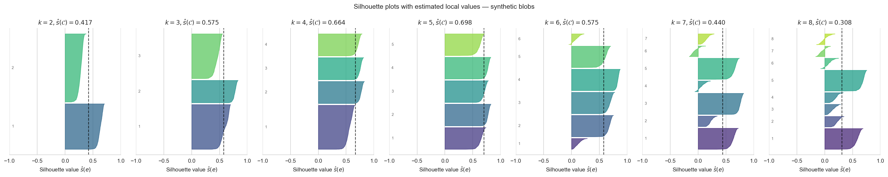
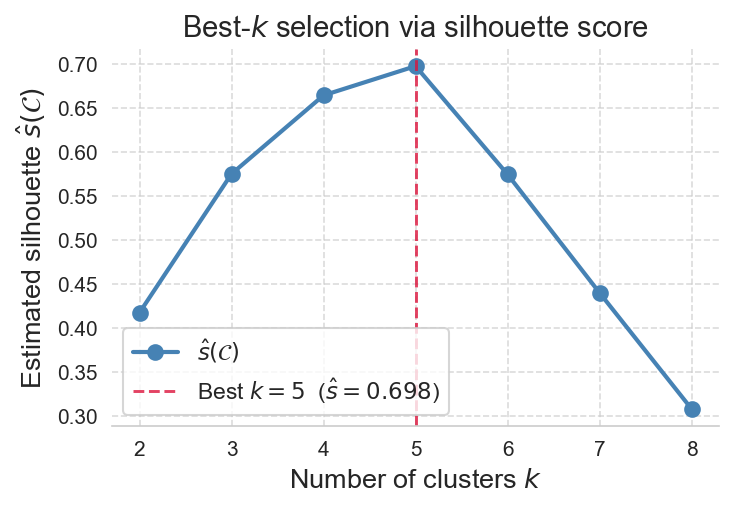

# Scalable and Distributed Silhouette Approximation

> I.Sarpe, F.Altieri, A.Pietracaprina, G.Pucci, F.Vandin. Scalable and Distributed Silhouette Approximation, arXiv, 2026. [Read the paper](https://arxiv.org/abs/2607.01993)

This repository contains the code for _Scalable and Distributed Silhouette Approximation_. It provides efficient approximate methods to compute the average and local [silhouette coefficient](https://en.wikipedia.org/wiki/Silhouette_(clustering)) of a $k$-clustering under arbitrary metric distances.

Given a clustering $\mathcal{C} = \\{C_1, \dots, C_k\\}$ of a dataset $V = \\{e_1,\dots,e_n\\}$, the silhouette of a point $e \in C$ is

$$
s(e) = \frac{b(e)-a(e)}{\max\\{a(e), b(e)\\}}, \qquad
a(e) = \frac{\sum_{e' \in C} d(e,e')}{|C|-1}, \qquad
b(e) = \min_{C_j \neq C}\frac{\sum_{e' \in C_j}d(e,e')}{|C_j|},
$$

and the average silhouette of the clustering is $s(\mathcal{C}) = \frac{1}{n}\sum_{e\in V} s(e)$.

<p align="center">
  
  
</p>

The table below summarises our estimators for the global silhouette and their guarantees.

| C++ function | Estimator | Guarantee | Distance computations | Probability |
|---|---|---|---|---|
| `ComputeEstimatorSubsample` | $\hat{s}_1$ | $\lVert\hat{s}_1 - s(\mathcal{C})\rVert \le \varepsilon$ | $O\!\left(\frac{n}{\varepsilon^2}\log\frac{1}{\delta}\right)$ | $> 1-\delta$ |
| `ApproximateSilhPPS` | $\hat{s}_2$ | $\lVert\hat{s}_2 - s(\mathcal{C})\rVert \le \frac{4\varepsilon}{1-\varepsilon}$ | $O\!\left(\frac{nk}{\varepsilon^2}\log\frac{nk}{\delta}\right)$ | $> 1-\delta$ |
| `ApproximateSilhPPS` | $\hat{s}_3$ | $\lVert\hat{s}_3 - s(\mathcal{C})\rVert \le \frac{4\varepsilon_1}{1-\varepsilon_1} + \varepsilon_2$ | $O\!\left(\!\left(n+\frac{m k}{\varepsilon_1^2}\right)\log\frac{nk}{\delta_1}\right)$ | $> (1-\delta_1)(1-\delta_2)$ |

---

## Installation

**Linux (Ubuntu/Debian)**
```bash
sudo apt install g++ make libhdf5-dev nlohmann-json3-dev
cd cppCode && make
conda env create -f environment.yml && conda activate silhouetteEnv
```

**macOS** (requires [Homebrew](https://brew.sh))
```bash
brew install hdf5 libomp nlohmann-json
cd cppCode && make
conda env create -f environment.yml && conda activate silhouetteEnv
```

The Makefile detects the platform and selects HDF5 and OpenMP paths automatically.

**Apptainer** (recommended for HPC / reproducibility)

`image.def` at the repository root builds a container with the full toolchain. Source code is bind-mounted at runtime, so Python scripts can be edited without rebuilding the image.

```bash
apptainer build image.sif image.def   # build once from repo root
sbatch slurm_launcher.slurm           # submit; compiles C++ on first run
```

---

## Quickstart

`cppCode/quickstart.py` is a self-contained demo: no data download required. It runs `ApproximateSilhPPS` on a 2000-point synthetic dataset (`make_blobs`, 5 true clusters, 8 dimensions) and produces the plots below.

```bash
cd cppCode
python quickstart.py --run ./efficientSilh               # k ∈ {2,…,8}, plots to examples/out/
python quickstart.py --run ./efficientSilh --plots-dir ../plots   # write plots to plots/
python quickstart.py                                     # config files only, no binary needed
```

<p align="center">
  <br>
  <em>Per-cluster silhouette distributions for k ∈ {2,…,8}. At k = 5 (the true number of clusters) all clusters show uniformly high values and the global average peaks.</em>
</p>
<p align="center">
  <br>
  <em>Estimated average silhouette vs k — the peak at k = 5 correctly identifies the true cluster count.</em>
</p>

### Configuration reference

The binary is driven by a JSON config file: `./efficientSilh config.json`. Running `quickstart.py` without `--run` writes one config per $k$ to `examples/out/` so you can inspect the format directly.

```json
{
  "mode":       4,
  "dataset":    "points.csv",
  "assignment": "labels.csv",
  "distance":   "euclidean",
  "k":          5,
  "t":          64,
  "delta":      0.01,
  "threads":    1,
  "seed":       42,
  "outfile":    "result.json"
}
```

| Field | Description |
|---|---|
| `mode` | `4` for standalone use |
| `dataset` | CSV of features — no header, one point per row |
| `assignment` | CSV of integer cluster labels — one per row, 0-indexed |
| `distance` | `euclidean`, `squared`, `manhattan`, `cosine`, or `canberra` |
| `k` | Number of clusters |
| `t` | Sample size (PPS samples per cluster); mutually exclusive with `epsilon` |
| `epsilon` | Approximation parameter; `t` is derived from the sample-complexity bound |
| `delta` | Failure probability |
| `threads` | OpenMP thread count |
| `seed` | RNG seed |
| `outfile` | Output path for the result JSON |

The result JSON contains `global_silhouette`, per-point `local_silhouette`, and runtime information.

---

## Reproducing paper results

All steps run from `cppCode/` with the `silhouetteEnv` environment active.

**1. Download and prepare datasets**

Download links and preprocessing notes are in `data/links.txt`. After decompressing each dataset, convert it to CSV:

```bash
cd data
python parseData.py metro   # produces real/metro.csv
# repeat for each dataset
```

**2. Cluster datasets**

```bash
python driver.py clust-real      # k-means / k-medoids → data/real/clust/*.hdf5
```

**3. Compute exact silhouette** (ground truth, small datasets only)

```bash
python driver.py ex-silh-real
```

**4. Run approximate methods**

```bash
python driver.py approx-silh-real-ex   # PPS, uniform, and baselines → results/real/
python driver.py parallel-tests        # parallel scalability experiments
```

**5. Best-k selection experiments**

```bash
python driver.py clust-bestk
python driver.py ex-silh-bestk
python driver.py approx-silh-bestk
```
